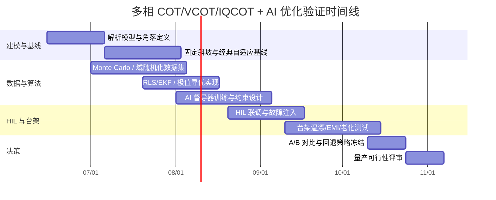

# 多相 Buck 转换器中基于 AI 的 COT 类控制优化研究

## 执行摘要

本文的核心判断是：**在多相 Buck 中，AI 去实时优化 COT 类控制的“必要性”并不是普适成立，而是强烈依赖场景；但其“可行性”在数字控制条件下是成立的，前提是把 AI 放在受约束的督导层，而不是直接替代纳秒级的硬实时开关决策内环。**对单相、工况窄、模拟纹波注入成熟、输出电容 ESR 不低、温漂与老化不敏感的设计，传统解析设计、增益调度和经典自适应通常已经足够。相反，对**多相、低 ESR MLCC、大电流、高带宽、宽输入/温度范围、DCR 电流检测、相位重叠、数字采样/量化/延迟显著**的系统，理论斜坡补偿与实物最佳值之间会出现持续、系统性的偏离，这时“在线调优斜坡/注入纹波/相位修整/限速参数”的价值明显上升。citeturn38view0turn39view0turn42view0turn27search20

从控制机理看，单相 COT/VCOT 的很多“够用”经验公式，在多相和数字化后会同时遭遇三类失配：其一，**功率级参数失配**，例如 MLCC 的 DC Bias、温度和 aging 使 \(C_\mathrm{eff}\) 与 ESR 偏离名义值，电感容差与 DCR 温漂改变等效电流斜率；其二，**测量链失配**，例如 DCR 电流检测时间常数失配、采样量化、ADC 偏移、时钟抖动、PWM 边沿抖动、EMI 与测量噪声；其三，**结构性失配**，例如多相交错下的纹波抵消、相位重叠、相间失配和数字延迟。文献已经明确指出：在多相相位重叠条件下，单相 COT 的小信号等效不再成立；对多相 V²/VCOT，**即使使用大 ESR 电容，在相位重叠区也可能仍然不稳定，外加斜坡和物理电流环都会变成必要条件**。citeturn38view0turn35search5turn39view0

从工程路线看，最稳妥的落地方案不是“AI 直接输出每个 PWM 周期的门极命令”，而是**模拟或 FPGA 事件路径继续负责纳秒级硬实时比较/一次导通/限流，AI 只在 10–100 个开关周期以上的时间尺度上更新斜坡斜率、纹波注入幅值、相位补偿、droop 参数、模式切换阈值和观测器参数**。这是因为数字控制延迟会直接折损相位裕度；TI 的数字电源资料明确指出采样、转换与计算延迟会降低有效相位裕度，而 ST 的数字 STVCOT 资料也强调需要过采样控制以避免损害瞬态性能。citeturn32search4turn32search1turn27search20turn33search10

因此，本文的最终建议是：**先做经典自适应，再决定是否引入 AI。**推荐的实施顺序是：先用解析模型 + Monte Carlo 找出敏感参数；再用增益调度、RLS/EKF 在线辨识、极值寻优或贝叶斯优化构成“强基线”；只有当多变量耦合、非线性时变、老化/温漂/EMI/相位重叠共同作用下，经典方法无法在全角落维持同等瞬态/稳定/效率/电流均衡指标时，才让 AI 进入，而且必须是**有包络约束、可回退、可记录、可离线复盘**的督导式优化器。citeturn29view0turn25search2turn24search5turn24search1turn30view1

## COT、VCOT、IQCOT 的原理与标准公式

需要先说明术语。业界对 **VCOT** 的命名并不完全统一：有的文献把它泛称为“电压型 constant-on-time”，有的厂商又把基于 VCO 的数字 COT 架构称为 VCOT/STVCOT。下面统一把 **VCOT** 理解为“以输出电压/误差信号为主导变量的 COT 家族”，并在数字实现部分单独讨论 VCO 型数字实现。**IQCOT** 则指 inverse-charge constant-on-time，一类通过积分电流差自动形成调制而不依赖输出纹波本身的 COT。citeturn39view0turn33search10turn44search0

下面的标准公式都基于同一组常见假设：Buck 工作在 CCM；单相等效功率级用于标称公式；一个周期内参数近似恒定；输出纹波相对直流量较小；\(C_\mathrm{eff}\) 与 \(R_\mathrm{ESR}\) 表示“实际有效值”；若讨论多相重叠，则额外引入相位管理器与总电流纹波。Microchip 的 ACOT/COT 应用笔记、V²/VCOT 的 sampled-data 建模论文，以及 Virginia Tech 关于多相 COT 的系统建模都采用了与此一致或相近的分析前提。citeturn28search13turn39view0turn38view0

对 Buck 而言，电感电流上升、下降斜率分别为

\[
m_1=\frac{V_\mathrm{in}-V_o}{L},\qquad
m_2=\frac{V_o}{L}
\]

在稳态近似固定频率下，

\[
D \approx \frac{V_o}{V_\mathrm{in}},\qquad
t_\mathrm{on}\approx \frac{D}{f_s}
\]

于是单相电感纹波近似为

\[
\Delta i_L \approx m_1 t_\mathrm{on}
=\frac{V_o(V_\mathrm{in}-V_o)}{L f_s V_\mathrm{in}}
\]

若输出电容电流近似三角波，则输出纹波可分解为 ESR 纹波和电容纹波：

\[
\Delta v_{\mathrm{ESR,pp}}\approx \Delta i_L R_\mathrm{ESR},\qquad
\Delta v_{C,\mathrm{pp}}\approx \frac{\Delta i_L}{8C_\mathrm{eff}f_s}
\]

这些量既是传统 COT/VCOT 的天然调制量，也是后续判断“是否必须额外注入斜坡”的起点。citeturn37view0turn28search13turn35search5

对**纹波型 COT/VCOT**，可以把比较器条件写成一个统一形式：

\[
v_\mathrm{fb}(t) \le v_c(t)+v_r(t)
\]

其中 \(v_c(t)\) 来自误差放大器或数字补偿器，\(v_r(t)=m_at\) 是外加人工斜坡或等效注入纹波。对于低 ESR 陶瓷输出电容，单靠输出纹波往往不足以保证稳定工作，实际工程中就会采用 SW 节点 RC 注入或显式外加斜坡。Microchip 在 ACOT 设计中给出的经验目标是**反馈纹波约 40–100 mV**；对其 Type-3 SW 节点注入，近似有

\[
\Delta V_{\mathrm{FB}} \approx \frac{V_\mathrm{in}D(1-D)}{R_i C_\mathrm{FF}f_s}
\]

因此可反求

\[
R_i \approx \frac{V_\mathrm{in}D(1-D)}{\Delta V_{\mathrm{FB}} C_\mathrm{FF}f_s}
\]

这是非常实用、也最容易被数字控制“在线改写”的补偿公式之一。citeturn40view2turn28search13

对**输出纹波是否本身足够**，一个常见的近似判断来自三角纹波模型：令 ESR 纹波至少不低于电容纹波，则有

\[
R_{\mathrm{ESR,crit}}\approx \frac{t_\mathrm{on}}{2C_\mathrm{eff}}
\]

当 \(R_\mathrm{ESR}<R_{\mathrm{ESR,crit}}\) 时，直接输出纹波调制会变得脆弱，VCOT/RBCOT 往往需要额外纹波注入或外加斜坡；而在多相交错、尤其靠近纹波抵消点时，这个近似阈值通常还会进一步恶化。TI 的 D-CAP/ACOТ 资料、Microchip 的应用笔记以及多相 COT 建模工作都指向同一结论：**低 ESR MLCC + 多相交错**是理论斜坡与实际最优补偿最容易脱节的组合。citeturn35search5turn28search13turn42view0turn38view0

对**IQCOT**，其调制并不依赖输出纹波，而是让“控制电压与电流检测信号之差”经跨导与积分电容转化为阈值到达时间。根据 IQCOT 的原理描述，可写成

\[
i_\mathrm{chg}=g_m\left(V_c-R_i i_L\right),\qquad
\frac{dV_T}{dt}=\frac{i_\mathrm{chg}}{C_T}
\]

若电容电压 \(V_T\) 从 \(V_{T,0}\) 充到阈值 \(V_{T,\mathrm{th}}\)，则

\[
t_\mathrm{on}
=
\frac{C_T\left(V_{T,\mathrm{th}}-V_{T,0}\right)}
{g_m\left(V_c-R_i i_L\right)}
\]

这说明 IQCOT 的等效“斜坡”是**由 \(g_m\)、\(C_T\)、阈值窗口与电流检测共同形成的内生积分斜坡**，而不是一个外加的独立锯齿波。其优点是能够在纹波抵消点仍保持多相可操作性，并且提升噪声免疫能力；缺点是实现更复杂，对跨导、积分电容、阈值和电流检测链的失配更敏感。citeturn43view2turn44search0turn43view1

多相条件下，最重要的“标准结论”来自相位重叠分析。Virginia Tech 的 2026 年博士论文明确指出：单相与多相 COT 的小信号等效只在**无相位重叠或 \(D<1/N\)** 时成立；一旦 \(D>1/N\)，总电流纹波的调制机理改变，单相模型不再可直接套用。对多相 current-mode COT，**两相重叠**时最小外加斜坡满足

\[
S_{e,\mathrm{crit}}=\frac12 S_{\mathrm{sense},\uparrow}
\]

而**三相重叠**时

\[
S_{e,\mathrm{crit}}=S_{\mathrm{sense},\uparrow}
\]

再往上还会继续增加。对多相 V²/VCOT，论文进一步指出：**直接输出电压反馈在相位重叠区天然不稳定；即使采用大 ESR 电容也不能保证稳定，必须加外部斜坡，而外部斜坡只有在输出纹波具有足够“电流强度”时才真正有效，因此低 ESR 陶瓷电容场景常常还需要物理电流环。**这组结论是本文判断“AI 是否有必要介入在线优化”的关键理论依据。citeturn38view0turn39view0

## 理论斜坡与实物偏离的来源

理论斜坡补偿常把“功率级、检测链、比较器、数字调制器”当作名义参数固定的线性块来处理；但真实多相 Buck 中，几乎所有块都会漂移。更关键的是，这些漂移不是独立相加，而是**乘性耦合**：例如 MLCC 的 \(C_\mathrm{eff}\) 变化不仅改变电容纹波，还会改变 ESR 临界值、输出极点、Vc 所需动态范围，以及对采样/量化噪声的等效斜率放大。citeturn15search0turn15search8turn16search2turn32search4

下表把对 COT/VCOT/IQCOT 最要紧的不确定性来源按照“会如何改变斜坡或稳定性”的方式归纳出来。表中“典型/依据”尽量给出文献或器件资料的范围；若文献只证明该效应存在而未给出统一数值，我会明确标注为“示例假设”。

| 类别 | 主要不确定源 | 它改变什么 | 典型/依据 |
|---|---|---|---|
| 功率级参数 | 电感容差、饱和、温升 | 改变 \(m_1,m_2,\Delta i_L\)，进而改变天然纹波、注入纹波标定和电流环相位 | 电源电感常见容差可到 ±20%；DCR 多有 5% 或 10% 公差。citeturn17search0turn17search2turn17search18 |
| 电容参数 | MLCC 的 DC Bias、温度、aging、ESR/ESL 频散 | 改变 \(C_\mathrm{eff}\)、\(R_\mathrm{ESR}\)、ESL 谐振点，直接影响 VCOT/RBCOT 的可调制纹波与极点/零点位置 | Murata、TDK、KYOCERA-AVX 均说明 Class-II MLCC 存在明显 DC Bias 与 aging；X7R 温度特性为 ±15%。citeturn15search0turn15search8turn16search0turn16search2turn16search9 |
| 电流检测 | DCR sensing、采样电阻、运放增益/偏移/漂移 | 改变 sensed slope \(S_{\mathrm{sense}}\)，相当于“把斜坡尺子拉伸或压缩” | INA241A 最大增益误差 ±0.01%、偏移 ±10 µV；而 DCR sensing 的直流限流精度常只做到约 10–15%。citeturn19search1turn19search13turn19search15 |
| 温度 | 铜电阻温漂、器件延迟漂移、参考源漂移 | 影响 DCR 电流检测时间常数、比较器阈值、PWM 传播延迟 | NIST/铜标准给出 \( \alpha_{Cu}\approx 0.00393/\!^\circ \mathrm C \)。citeturn18search6turn18search9 |
| 数字采样 | ADC 量化、偏移、INL/DNL、采样保持误差 | 让斜坡变“台阶化”、引入偏置与幅值压缩，触发 limit cycle 或频率抖动 | TI/ADI 的数据转换资料给出量化噪声与 aperture jitter 的基本关系。citeturn13search5turn13search0turn14search17 |
| 数字时序 | 采样-计算-更新延迟、DPWM 分辨率、时钟抖动 | 直接损失相位裕度；边沿抖动变成等效斜坡噪声 | TI 明确指出数字延迟会降低相位裕度；HRPWM/FEP 分辨率可做到 150 ps 或 78 ps，但系统总延迟仍是关键。citeturn32search4turn20search1turn21search0 |
| EMI 与测量噪声 | SW-node 共模干扰、布局耦合、地弹噪声 | 造成比较器误触发、FB 纹波畸变、ADC 采样污染 | TI 的 INA24x 系列强调 enhanced PWM rejection，就是为抑制这类开关共模污染。citeturn19search0turn19search1 |
| 多相交错 | 相位偏移误差、相间 on-time 不一致、驱动不匹配 | 破坏纹波抵消，增大总输出纹波与电流不均 | 多相的优势与挑战均依赖准确交错；相位重叠时单相模型失效。citeturn37view1turn38view0turn42view0 |
| 负载动态 | \(\mathrm dI/\mathrm dt\) 极高、负载模式跳变 | 让固定斜坡在不同瞬态阶段并非同时最优 | 现代 CPU/AI 负载可出现极高速跃迁，COT 正是为此常被采用。citeturn42view0 |
| 老化与寿命 | MLCC aging、焊点/铜箔电阻变化、磁材老化 | 让出厂标定斜坡随时间偏离最佳值 | TDK 明确指出 Class-II MLCC 的 aging 以“每十倍时间的百分比衰减”表征，并给出 1000 h 标准。citeturn16search2turn16search9 |
| 模型失配 | 忽略 ESL、寄生电阻、封装/布局、电流环附加极点 | 让理论斜坡补偿低估高频相位损失 | 近期 sampled-data 与多相描述函数建模，正是为修复传统简化模型在高频和相位重叠下的误差。citeturn39view0turn38view0turn28search7 |
| 实现差异 | VCOT 命名/架构差异、模拟/数字混合实现 | 同名“VCOT”在不同实现中的可调参数并不相同 | ST 的数字 STVCOT 属于 VCO 型数字实现；学术文献中的 V-COT 则更多指 voltage-mode COT。citeturn33search10turn39view0 |

从这些来源看，真正最“致命”的不是某一个参数漂了多少，而是**多个机制同时改变“斜坡幅值、斜坡相位、交越频率、相位裕度和比较器 crossing time”**。这正是为什么在某些多相数字 VR 中，实验台上最终调出来的最佳斜坡往往与纸面公式偏差不小。citeturn38view0turn39view0turn32search4

## 灵敏度、最坏情况边界与代表性算例

为了把上面的不确定性落到可量化层面，下面采用两个**无特殊约束时的代表性工况**：

**工况 A：**四相 12 V → 1.0 V，500 kHz/相，\(L=220\ \mathrm{nH}\)，\(C_\mathrm{eff}=500\ \mu\mathrm F\)，\(R_\mathrm{ESR}=0.5\ \mathrm{m}\Omega\)。这是典型 CPU/ASIC 核心电压轨的数量级。
**工况 B：**四相 12 V → 5.0 V，500 kHz/相，\(L=220\ \mathrm{nH}\)，用于展示 \(D>1/N\) 时的两相重叠与最小斜坡要求。
这两组参数不是某个特定产品，而是为便于比较各不确定性的“同口径算例”。其公式基础来自前述 COT/VCOT/IQCOT 建模与应用笔记。citeturn28search13turn38view0turn39view0

在工况 A，下列标称量可直接算出：

\[
D=0.0833,\quad
t_\mathrm{on}=166.7\ \mathrm{ns},\quad
m_1=50\ \mathrm{A/\mu s},\quad
m_2=4.55\ \mathrm{A/\mu s}
\]

\[
\Delta i_L \approx 8.33\ \mathrm A_{pp},\quad
\Delta v_{\mathrm{ESR,pp}}\approx 4.17\ \mathrm{mV},\quad
\Delta v_{C,\mathrm{pp}}\approx 4.17\ \mathrm{mV}
\]

也就是说，在名义值下，**单相天然输出纹波只有几毫伏量级**；到多相交错后，比较器真正看到的可用调制纹波还会更小。这与 Microchip 对 ACOT 推荐“反馈纹波 40–100 mV”的工程经验相比，相差一个数量级，已经足以解释为什么多相低 ESR 场景基本都会采用外部纹波注入或人工斜坡。citeturn40view2turn28search13

一个非常有用的灵敏度公式是 Type-3 注入纹波

\[
\Delta V_{\mathrm{FB}} \approx \frac{V_\mathrm{in}D(1-D)}{R_i C_\mathrm{FF}f_s}
\]

其相对灵敏度为

\[
\frac{\partial \ln \Delta V_{\mathrm{FB}}}{\partial \ln V_\mathrm{in}}=1,\quad
\frac{\partial \ln \Delta V_{\mathrm{FB}}}{\partial \ln R_i}=-1,\quad
\frac{\partial \ln \Delta V_{\mathrm{FB}}}{\partial \ln C_\mathrm{FF}}=-1,\quad
\frac{\partial \ln \Delta V_{\mathrm{FB}}}{\partial \ln f_s}=-1
\]

而对 duty，有

\[
\frac{\partial \ln \Delta V_{\mathrm{FB}}}{\partial \ln D}
=\frac{1-2D}{1-D}
\]

在工况 A，若目标反馈纹波取 50 mV，令 \(C_\mathrm{FF}=10\ \mathrm{nF}\)，则可反算 \(R_i\approx 3.67\ \mathrm{k}\Omega\)。此时若 \(R_i\) 为 ±1%、\(C_\mathrm{FF}\) 为 ±5%，仅器件公差就会带来约 **±6%** 的注入纹波误差；如果再叠加 \(f_s\) 漂移或数字更新造成的等效占空变化，幅值偏差会继续放大。citeturn40view2turn28search13

另一个很有代表性的边界条件是 ESR 临界值：

\[
R_{\mathrm{ESR,crit}}\approx \frac{t_\mathrm{on}}{2C_\mathrm{eff}}
\]

在工况 A 的名义值下，

\[
R_{\mathrm{ESR,crit}}\approx 0.167\ \mathrm{m}\Omega
\]

如果把 \(C_\mathrm{eff}\) 因 DC Bias、温度、老化等原因做一个**保守示例假设**：总有效电容下降 40%，则 \(C_\mathrm{eff}\) 从 500 µF 变为 300 µF，临界 ESR 会立刻上升到约

\[
R_{\mathrm{ESR,crit}}\approx 0.278\ \mathrm{m}\Omega
\]

换句话说，某个原本“刚好够”的 VCOT/RBCOT 方案，可能在温度、偏压和寿命角落里突然变成“天然纹波不够”，必须依赖更大的外加斜坡才能维持相近稳定性。这就是 AI/自适应在线补偿的典型入口。MLCC 的 DC Bias、X7R 的温度变化和 aging 的存在本身都有明确厂家资料支持；这里的 40% 仅作为工程算例，而非任何单一器件的通用保证值。citeturn15search0turn15search8turn16search0turn16search2turn16search9

如果采用 **DCR 电流检测**，问题会更严重，因为其本质依赖时间常数匹配：

\[
\tau_\mathrm{emu}=R_s C_s \approx \frac{L}{R_\mathrm{DCR}}
\]

对小偏差做一阶展开，

\[
\frac{\delta \tau}{\tau}
\approx
\frac{\delta R_s}{R_s}
+\frac{\delta C_s}{C_s}
-\frac{\delta L}{L}
+\frac{\delta R_\mathrm{DCR}}{R_\mathrm{DCR}}
\]

若电感容差 ±20%，电阻 ±1%，电容 ±5%，而铜 DCR 在 25°C→125°C 上升约 39.3%，那么仅从这些来源叠加，**热端最坏方向**的时间常数失配就可能达到大约 **+65%**；反向冷端也可能达到 **-26%** 左右。由于 DCR 采样网络本身就是用来“模拟”电感电流斜坡的，这种失配会直接折算成斜坡形状与幅值偏差，而不是一个可忽略的小误差。citeturn17search0turn18search6turn18search9turn19search15turn19search2

数字链路的不确定性可以用更简洁的边界式来量化。对总延迟 \(T_d\)，交越频率 \(f_c\) 处相位裕度损失近似为

\[
\Delta PM \approx -360^\circ f_c T_d
\]

因此，若 \(f_c=100\ \mathrm{kHz}\)，则 150 ns、300 ns、1 µs 的总延迟分别约损失 **5.4°、10.8°、36°** 的相位裕度；若希望把交越推到 200 kHz，这三组损失会翻倍。TI 的数字电源控制资料对此给出了非常明确的工程提醒：采样、转换和计算延迟会降低有效相位裕度。citeturn32search4turn32search1

量化误差则可以直接与目标斜坡幅值比较。若 ADC 满量程 1.2 V，则 10 位分辨率的 LSB 为 1.172 mV，12 位为 0.293 mV。把它与 Microchip 推荐的 20–100 mV 级反馈纹波相比：当目标斜坡仅 20 mV 时，10 位 ADC 的一位就是 **5.86%** 的斜坡幅度，12 位则是 **1.46%**。如果再考虑偏移、INL/DNL 和数字滤波延迟，完全数字化的细粒度斜坡整形就会很快接近“分辨率墙”。这也是为何不少全数字 COT 研究会专门处理 A/D sample delay 和 sampling noise 问题。citeturn13search5turn14search17turn33search4

对抖动与噪声，最直接的分析量是 crossing-time 抖动。若比较器看到的有效斜率为 \(s_r=\mathrm dV/\mathrm dt\)，电压噪声均方根为 \(\sigma_v\)，时钟/边沿抖动为 \(\sigma_j\)，则 crossing-time 误差可近似写成

\[
\sigma_t \approx \frac{\sqrt{\sigma_v^2+(s_r\sigma_j)^2}}{s_r}
\]

例如工况 A 若以 50 mV/166.7 ns 的斜坡工作，则 \(s_r\approx 0.30\ \mathrm{mV/ns}\)。1 ns 的边沿抖动就相当于约 0.30 mV 的电压误差；若噪声为 1 mV\(_\mathrm{rms}\)，则 crossing-time 抖动已是数纳秒甚至接近 10 ns 量级。这对 100–200 ns 级的 on-time 来说绝不算小。ADI 关于 ADC aperture jitter 的资料给出了同类“斜率乘抖动即电压误差”的基本关系；在 COT 里，只是把输入正弦替换成了比较器斜坡。citeturn13search0

多相特有的问题在工况 B 更清楚。四相 12→5 V 时，\(D=0.417>1/N=0.25\)，已进入两相重叠区。此时若每相 \(L=220\ \mathrm{nH}\)，则每相上升斜率为

\[
m_1=\frac{12-5}{220\ \mathrm{nH}}\approx 31.8\ \mathrm{A/\mu s}
\]

两相重叠时的总 sensed 上升斜率约为 \(63.6\ \mathrm{A/\mu s}\)。按 Virginia Tech 的结论，最小外加斜坡应达到它的一半；如果电流检测增益为 \(5\ \mathrm{mV/A}\)，那么

\[
S_{e,\mathrm{crit}}
\approx 0.5\times 63.6 \times 5
\approx 159\ \mathrm{mV/\mu s}
\]

只要电流检测增益有 10% 偏差，这个最小要求就会立刻偏离约 ±15.9 mV/µs。换言之，在多相重叠区，**斜坡补偿已经不是“锦上添花”，而是稳定边界本身的一部分。**citeturn38view0turn19search1

最后，把主要因素按“对斜坡/稳定边界的破坏力”排序，结论大致如下：**第一梯队**是相位重叠、多相纹波抵消、DCR 检测失配、数字总延迟；**第二梯队**是 \(C_\mathrm{eff}\)/ESR 漂移、量化/噪声/抖动、相位/导通时间失配；**第三梯队**是慢速老化、参考源缓慢漂移、轻微 EMI 背景噪声。也就是说，真正决定“需不需要 AI” 的，往往不是某个电容偏了 5%，而是**多个一阶与高频误差同时叠加时，解析建模是否还足够抓住最优补偿点**。citeturn38view0turn39view0turn32search4

## AI 实时优化的必要性与可行性

从“必要性”看，AI 不是因为“行业流行”而必要，而是因为某些多相数字 COT 系统已经呈现出**高维、非线性、时变、多目标**的调参特征。近期中文综述把电力电子智能化分为“设计智能化”和“装备智能化”；其中后者要求与硬件实时交互，而控制设计、运行优化、状态感知正属于这一类。该综述还明确区分了专家系统、启发式算法、深度监督学习与深度强化学习的输入要求和适用任务，这为本文判断“AI 应不应该进入控制器在线路径”提供了相当直接的框架。citeturn30view1turn31search1

对 COT/VCOT/IQCOT 而言，AI 只有在以下场景中才具有明显必要性：
一是**多相 + 相位重叠 + 低 ESR MLCC + 物理/数字电流环共存**，因为最低稳定斜坡随占空、重叠相数、检测链和温度一起变化；
二是**工况跨度大**，例如输入电压、相数、负载斜率、热状态、droop 模式频繁变化；
三是**优化目标多且相互冲突**，例如既要瞬态压摆最小，又要频率抖动可控、相电流均衡、效率不下降、EMI 不恶化；
四是**存在慢时变劣化**，例如 MLCC aging、铜 DCR 漂移、焊点电阻变化，使得出厂标定逐渐失效。
反之，如果相数少、占空比离重叠区远、检测链稳定、输出纹波充足、数字延迟可忽略，那么 AI 的必要性很低。citeturn38view0turn39view0turn16search2turn16search9

从“可行性”看，Buck 控制领域已经有足够多的 AI 先例，但**绝大多数证据来自一般 Buck 控制，而不是直接来自 COT 斜坡在线优化**。例如，神经网络预测控制可以缓解传统 MPC 对模型精度敏感的问题；自适应神经网络控制、DNN-SMC 在 Buck 上也已经报告了仿真与硬件结果；而更激进的 DRL 直接门极控制目前仍主要停留在仿真验证。换句话说：**AI 提升 Buck 控制是可行的；但 AI 专门优化多相 COT 斜坡补偿，还处于“可以做、值得做，但公开工程证据仍有限”的阶段。**citeturn24search5turn25search2turn24search1turn24search9

与 AI 竞争的，并不是“什么都不做”，而是**经典自适应方法**。这一点非常重要。COT 家族本身就大量存在“非 AI 的在线或自适应”设计：例如 adaptive-on-time Valley Current 模式、基于遗传算法的高频小信号模型参数寻优、以及为克服 A/D sample delay 与 sampling noise 而提出的数字积分式常导通时间控制。也就是说，在很多项目里，工程上真正的决策不是“AI vs 传统固定参数”，而是“AI vs 经典自适应/极值寻优/增益调度/RLS-EKF”。citeturn29view0turn28search7turn33search4

从推荐顺序看，我认为最值得比较的算法族如下。

| 算法族 | 适合优化的对象 | 数据需求 | 在线计算负担 | 解释性与认证友好度 | 对本问题的建议 |
|---|---|---|---|---|---|
| 解析增益调度 | \(S_e,\Delta V_{FB},R_i,C_{FF}\) 的查表切换 | 很低 | 很低 | 很高 | 第一优先；应先做完整基线 |
| RLS/EKF/在线辨识 | \(L,C_\mathrm{eff},ESR,DCR,T_d\) 等状态估计 | 低 | 低到中 | 高 | 强烈推荐，尤其适合慢漂移与老化 |
| 极值寻优/贝叶斯优化 | 多目标代价函数 \(J\) 的慢时标优化 | 低到中 | 中 | 中高 | 很适合在线微调斜坡和 droop |
| 监督学习回归 | 从状态到最优参数 \( \theta^\star \) 的映射 | 需要大量离线标注数据 | 低 | 中 | 适合作为督导层；前提是仿真/实测数据足够 |
| 深度强化学习 | 直接输出参数增量甚至门极动作 | 训练需求高、奖惩设计难 | 中到高 | 低 | 不建议先上硬内环，只应做受限督导 |
| 混合式安全 AI | AI 只提议，安全壳负责裁剪与回退 | 中 | 中 | 中高 | 最值得工程化尝试的 AI 形态 |

该分类与中文综述对监督学习、强化学习需求差异的概括是吻合的：监督学习需要大量带标签数据，强化学习需要算法/网络/奖励设计，且实时装备智能化对算法时延提出更高要求。citeturn30view1turn31search1

如果把 AI 真正用于**多相 COT 的实时斜坡优化**，最合理的输入特征通常不是原始波形，而是“低维、物理可解释”的状态量，例如：\(V_\mathrm{in}\)、\(V_o\)、\(I_o\)、\(\mathrm dI_o/\mathrm dt\)、每相平均电流及纹波估计、相位重叠数、 \(C_\mathrm{eff}\)/ESR 在线估计、DCR 估计、温度、总延迟估计、EMI 或噪声统计量、当前斜坡幅值与抖动统计。输出也不应是直接门极，而应是一个**小维度参数向量**

\[
\theta = [S_e,\ \Delta V_{FB},\ t_\mathrm{on,\ trim},\ \phi_1\ldots\phi_N,\ K_\mathrm{droop},\ \text{mode thresholds}]
\]

这样既能控制模型规模，又更容易加边界和做回退。citeturn30view1turn24search5turn25search2

在数据方面，监督学习最适合采用“**仿真域随机化 + HIL 校正 + 台架少量微调**”的三段式流程。没有看到成熟的多相 COT 斜坡公开基准数据集，文献大多仍是各自构造仿真与样机验证平台，因此工程上更现实的选择是自建数据：大规模 Monte Carlo 扫描 \(L,C,ESR,DCR,T_d,\sigma_j,\sigma_v,\) 相数和 duty，再用少量 HIL/实机数据做域校正。AI 部分不需要大模型；以 24 维输入、两层全连接隐层的微型 MLP 为例，参数量只需千级，量化后内存可做到几 KB。真正难的不是算力，而是**训练分布是否覆盖坏角落**。citeturn24search1turn24search5turn25search2turn30view1

安全、鲁棒性和可解释性是 AI 方案最大的工程门槛。对汽车/工业场景，已有 MCU 平台提供 ISO 26262 ASIL B、IEC 61508 SIL 2 等功能安全配套资料；这反过来意味着，若把一个不可解释、在线持续自我更新的黑盒策略直接塞进硬实时控制主路径，认证与失效证明会明显复杂化。因此更现实的做法是：**AI 只在边界内缓慢更新参数；参数变化必须施加速率限制、上下界、异常检测、性能监控和一键回退；同时保留一套经认证/验证的经典控制参数作为安全基线。**这并不是否定 AI，而是把它放到证据链更容易建立的位置。citeturn21search3turn30view1

我的综合结论是：**AI 在本问题上是“可行但有条件”的。**如果目标是首款量产、可靠性优先、认证压力大，优先级应是“解析 + 经典自适应 + 少量机器学习辅助建模”；如果目标是高端服务器/AI 加速器 VR、工况极广、平台可接受 FPGA/SoC 成本、并且有完整 HIL/台架数据闭环，那么“督导式 AI 斜坡优化器”值得投入。citeturn39view0turn38view0turn27search20turn22search7

## 数字实现架构与工程权衡

数字化 COT 的难点不在于“算不过来”，而在于**要不要在纳秒级时间轴上完全数字化**。如果每相 500 kHz、12→1 V，则 \(t_\mathrm{on}\) 只有约 167 ns；在这个尺度上，比较器传播延迟、边沿时序、ADC 采样窗口和 PWM 更新时点都会直接进入控制律本身。高速度比较器的数据手册很容易就能看到 1–2 ns 级传播延迟；但若把同样的事情交给“采样—计算—更新”链路，MCU 即使主频够，系统总延迟通常也远大于单个模拟比较器。citeturn35search7turn32search4

因此，最合理的实现通常分成三类：**混合式、FPGA 式、MCU 全数字式**。其工程取舍如下。

| 架构 | 硬实时内环 | 典型器件与能力 | 适合的 AI 角色 | 优点 | 局限 |
|---|---|---|---|---|---|
| 模拟事件路径 + MCU 督导 | 模拟比较器/one-shot/限流；MCU 只更新时间常数与阈值 | TI C2000：100 MHz 浮点 MCU、HRPWM 150 ps；部分器件 ADC 可到 4 MSPS。citeturn20search0turn20search2turn20search1 | 增益调度、RLS/EKF、微型 MLP，更新周期 10–100 个开关周期 | 成本最低、验证最容易、最适合量产首版 | 纳秒级完全数字斜坡塑形能力有限 |
| 高速 DSC/数字电源 MCU | 事件更数字化，依赖高分辨率 PWM 与高速 ADC | dsPIC33AK：200 MHz、FEP 78 ps、ADC 最高 40 MSPS。citeturn21search0turn21search10 | 督导式 AI + 更快在线估计 | 比传统 MCU 更接近“准全数字”COT | 多相高频下仍需小心总延迟与同步 |
| FPGA / 纯逻辑事件驱动 | 比较、计时、相位管理、DPWM 全在逻辑中 | AMD 7 系列/Artix 7 有 36 Kb BRAM 与 DSP Slice；Cyclone 10 GX 有大量 DSP 与片上 RAM。citeturn22search5turn23search6 | 小模型 AI、贝叶斯优化、状态机与安全壳 | 最适合高相数、低时延、复杂相位管理 | 开发门槛高，验证与维护成本更高 |
| SoC FPGA | FPGA 做内环，A53/R5 做监督与 AI | Zynq MPSoC：A53 至 1.5 GHz，R5F 至 600 MHz，带片上存储。citeturn22search7 | 在线学习、日志、异常检测、策略切换 | 最均衡，适合高端平台和 HIL/量产共平台 | 成本、功耗、软件栈复杂度最高 |
| 数字 VCO 型多相 COT | 以数字 VCO / 过采样控制为核心 | ST TN1246 明确给出数字 STVCOT 多相方案，并强调过采样以保瞬态。citeturn27search20turn33search10 | 可叠加 AI 做参数督导 | 对多相数字 VCOT 很自然 | 对时序设计与采样架构要求高 |

如果目标是**AI 优化斜坡而不是 AI 直接闭环驱动门极**，那么内层算力需求其实不高。一个输入 16–32 维、两层隐藏层、千级参数的小 MLP，单次推理只需约千级乘加；即使每 20 µs 更新一次，也远低于现代 MCU/FPGA 的能力上限。真正的关键是**时延预算**：
第一，任何会影响**本周期/下周期导通边沿**的路径，都应尽量压到 \(t_\mathrm{on}\) 的 5–10% 以内；
第二，AI 输出参数必须经过**定点量化、速率限制、边界裁剪和新旧参数平滑过渡**；
第三，浮点更适合监督层估计与离线训练，内层参数下发通常应转换成固定点，以保证确定性与可复现性。
这些是工程规则，而不是某一篇论文的硬性结论，但它们与 TI/ST 对数字电源时延和过采样的提醒是一致的。citeturn32search4turn27search20

可执行的推荐架构是下面这种“**硬实时内环 + 安全壳 + AI 督导**”分层：

```mermaid
flowchart LR
    S[采样与观测<br/>Vin Vo Iout iL1...iLN 温度 延迟统计] --> E[在线估计<br/>Ceff ESR DCR 相位重叠数 噪声/抖动]
    E --> G[安全壳<br/>边界 速率限制 稳定区约束]
    G --> A[AI/自适应器<br/>输出 θ={Se ΔVFB Ton_trim 相位修整 Droop}]
    A --> Q[定点量化与平滑切换]
    Q --> H[硬实时控制<br/>Comparator / One-shot / DPWM / Phase Manager]
    H --> P[多相 Buck 功率级]
    P --> M[性能监控<br/>过冲 欠冲 纹波 抖动 电流均衡 效率]
    M --> E
    M --> F[回退逻辑<br/>异常即切回经典参数]
    F --> H
```

这类分层的价值在于：AI 只负责“把参数往更优方向推”，但**不能越过稳定域边界，也不能获得直接门极控制权限**。这样既保留了 AI 处理复杂时变耦合的能力，也尽量把可验证性留在硬实时路径上。citeturn21search3turn30view1

## 验证方案、决策标准与建议

验证不应只看“瞬态波形好不好看”，而要从一开始就把它设计成一个**对比基线明确、数据可重复、坏角落可覆盖**的流程。建议同时保留四组控制器：
其一，**固定解析斜坡基线**；
其二，**经典自适应基线**，如增益调度 + RLS/EKF；
其三，**无模型黑盒优化**，如极值寻优或贝叶斯优化；
其四，**AI 督导式优化器**。
这样才能回答用户最关心的问题：AI 到底是在解决“经典方法做不到”的问题，还是只是把已有调度表换了一层黑盒。citeturn29view0turn25search2turn24search5turn30view1

推荐的指标体系如下。

| 指标组 | 建议指标 | 说明 |
|---|---|---|
| 稳定性 | FRA 交越频率、相位裕度、增益裕度、是否出现亚谐波/跳周期 | 不能只看时域波形 |
| 瞬态 | 负载阶跃过冲/欠冲、恢复时间、峰值频率偏移、Ton 截断质量 | 建议覆盖不同 \(\mathrm dI/\mathrm dt\) |
| 纹波与噪声 | 输出纹波、反馈纹波、比较器 crossing jitter、频率抖动 | 直接对应斜坡优化效果 |
| 多相一致性 | 相电流均衡误差、相位偏差、on-time mismatch | AI 若破坏均流，应直接判负 |
| 效率与热 | 轻载效率、满载效率、功率器件温升、磁件损耗 | 不允许“以性能换效率”过头 |
| 鲁棒性 | 温度循环、老化后重测、输入扰动、EMI 注入、传感器偏移注入 | 这是 AI 是否真正有价值的分水岭 |
| 计算与实现 | CPU/FPGA 占用、内存、更新周期、回退时间、日志完整性 | 为量产与认证留证据 |

这些指标需要在**仿真、HIL、台架**三个层面全部打通。仿真用于大规模参数扫描和训练数据生成；HIL 用于延迟、噪声、极端负载事件和故障注入；台架最终验证真实寄生、EMI、温漂、热耦合和器件离散性。对多相 COT 来说，仅靠 SPICE/PLECS/SIMPLIS 中任意一种单一平台并不足够，尤其对相位重叠与数字延迟场景更是如此。citeturn38view0turn39view0turn27search20

我建议的数据构造方式如下：离线仿真采用 Latin Hypercube 或 Sobol 采样，覆盖 \(L,C,ESR,DCR,T_d,\sigma_v,\sigma_j,N,D\) 与负载动态；HIL 阶段注入 ADC 偏移、时钟抖动、相位偏差、温度模型和故障；台架阶段采用至少两种输出电容组合——“高 MLCC/低 ESR”与“混合 ESR 电容”——并至少选择两个 duty 区域：一个满足 \(D<1/N\)，另一个进入相位重叠区。否则，很容易把 AI 的收益误判成“只是对某个甜点工况调得更漂亮”。citeturn38view0turn35search5turn28search13

一个面向 4–6 个月项目周期的验证时间线可以写成下面这样：



基于前面的分析，**实际决策标准**可以设得非常明确：若 AI 方案不能在全角落下同时满足以下条件，就不应进入产品路径。建议门槛是：
一，最坏角落过冲/欠冲相对经典基线改善至少 **20%**；
二，稳定事件数（亚谐波、跳周期、异常频率抖动）**不增反降**；
三，效率损失不超过 **0.2–0.3 个百分点**；
四，计算占用小于平台预算的 **30%**；
五，参数变化全程可记录、可回放、可回退；
六，失效时回退到经典控制的时间小于一个设计规定窗口。
如果 AI 只在“好工况”下赢，而在热端、重叠区、EMI 注入或老化状态下变差，那么结论就应当是“不采用”。这类决策门槛本质上是工程治理，而不是算法崇拜。citeturn21search3turn32search4turn38view0

最终建议可以概括为三条。第一，**若你的主要不确定性是缓慢、可辨识、参数维度不高的漂移**，优先上解析设计 + 经典自适应，不必急于 AI。第二，**若你的核心难点是多相相位重叠、检测链时变、低 ESR、数字延迟与多目标权衡同时存在**，则 AI 作为督导层优化器是值得尝试的。第三，**不建议第一代产品就采用“AI 直控门极”的激进路线**；最合理的首发方案是“模拟/FPGA 硬实时路径 + AI 有界调参 + 严格回退”。citeturn38view0turn39view0turn24search9turn27search20

### 开放问题与局限

还有几处问题值得明确标出。第一，公开文献里关于“AI 专门优化多相 COT/VCOT/IQCOT 斜坡补偿”的直接实测证据，远少于“AI 改进一般 Buck 控制”的证据，因此本文关于 AI 必要性的判断，更多建立在**已被文献证明的多相 COT 建模困难**与**已被文献证明的 AI/Buck 控制可行性**之间的综合推断上。citeturn38view0turn24search5turn25search2

第二，本文给出的若干数值算例采用了“代表性参数”而非某一特定产品料号，因此它们的用途是**建立量级感与灵敏度直觉**，不是替代你项目的仿真和台架标定。特别是 MLCC 的 DC Bias 降额、ESL、EMI、布局寄生和相间失配，都会强烈依赖器件选型与 PCB。厂家资料明确证明这些效应存在，但不同 BOM 下的具体数值必须由你自己的角落仿真和样机测量闭环确认。citeturn15search0turn16search2turn37view1

第三，VCOT 术语在不同论文和厂商资料中的含义并不完全一致；本文已尽量把“电压型 COT 原理”和“基于 VCO 的数字 STVCOT 实现”区分开来，但在后续具体项目中，仍建议用一页术语定义文档把团队内部的 VCOT、RBCOT、V²-COT、CMCOT、IQCOT、DICOT 逐一固定，避免后续用同一个缩写指代不同控制结构。citeturn39view0turn33search10turn33search4