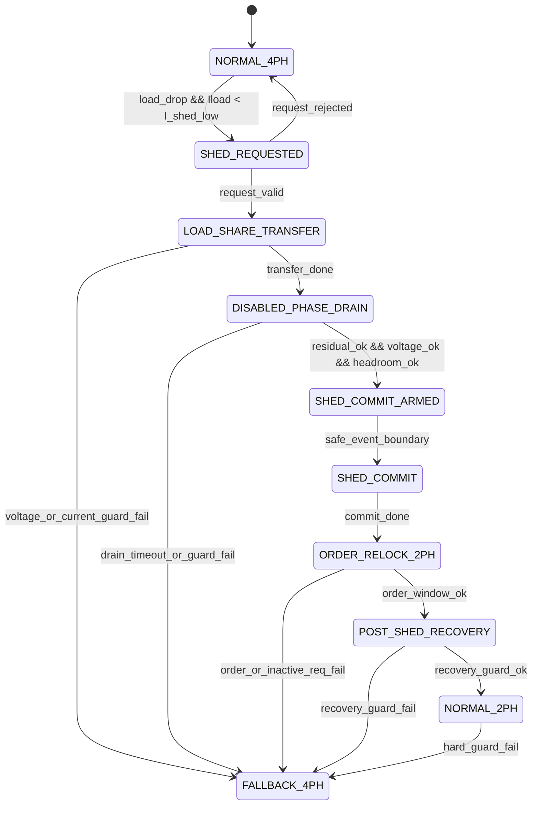

# E040-S1 Staged Shed-Handoff State Machine

Date: 2026-06-30

This is a design artifact only. It defines the state machine to implement before any new shed validation run.

## State List

```text
NORMAL_4PH
SHED_REQUESTED
LOAD_SHARE_TRANSFER
DISABLED_PHASE_DRAIN
SHED_COMMIT_ARMED
SHED_COMMIT
ORDER_RELOCK_2PH
POST_SHED_RECOVERY
NORMAL_2PH
FALLBACK_4PH
```

## State Definitions

| State | Active set | Purpose | Exit condition |
|---|---|---|---|
| `NORMAL_4PH` | `[1,1,1,1]` | Regular four-phase IQCOT operation | 4 -> 2 shed request is observed |
| `SHED_REQUESTED` | `[1,1,1,1]` | Latch target, request time, load estimate, Vout, and IL1..IL4 | Request is valid and branch is load-drop |
| `LOAD_SHARE_TRANSFER` | `[1,1,1,1]` | Transfer average current from phases `[2,4]` to `[1,3]` | Transfer progress reaches target or timeout/guard failure |
| `DISABLED_PHASE_DRAIN` | `[1,1,1,1]` with `[2,4]` energy-limited | Drain residual current in phases `[2,4]` | Residual, voltage, and current guards pass |
| `SHED_COMMIT_ARMED` | `[1,1,1,1]` | Prepare two-phase scheduler boundary | Next safe scheduler event boundary |
| `SHED_COMMIT` | atomic switch to `[1,0,1,0]` | Commit active set exactly once | Commit edge logged |
| `ORDER_RELOCK_2PH` | `[1,0,1,0]` | Relock logical slots to physical sequence `[1,3]` | Post-commit order window passes |
| `POST_SHED_RECOVERY` | `[1,0,1,0]` | Enable only conservative recovery | a_S guard passes or recovery timeout |
| `NORMAL_2PH` | `[1,0,1,0]` | Stable two-phase operation | Load-rise/add request or fallback guard |
| `FALLBACK_4PH` | `[1,1,1,1]` | Return to safe four-phase operation | Fault clears and operator/supervisor permits retry |

## State Flow



## Load-Share Transfer Rule

During `LOAD_SHARE_TRANSFER`, do not hard-disable phases `[2,4]`. Instead, use projected IQCOT parameter scheduling:

```text
For phases to disable [2,4]:
  reduce Ton contribution gradually
  or reduce accepted-event priority gradually

For retained phases [1,3]:
  allow gradual load-share increase within current-limit guard
```

Suggested continuous progress variable:

```text
shed_transfer_progress = clamp((t - transfer_start_time) / shed_transfer_window, 0, 1)
```

Guarded trims:

```text
Delta_Ton_disable = -shed_transfer_progress * max_transfer_Ton_trim
Delta_Ton_keep = +shed_transfer_progress * transfer_compensation_trim
```

All trims must pass voltage, current-limit, and `Ton` bounds before reaching IQCOT parameters.

## Disabled-Phase Drain Rule

During `DISABLED_PHASE_DRAIN`, phases `[2,4]` must not receive new high-side energy through the supervisory action path. The supervisor still does not command gates directly. It only projects the event and parameter schedule so new energy is not requested for candidate disabled phases.

Exit guards:

```text
abs(IL2) <= residual_current_threshold
abs(IL4) <= residual_current_threshold
Vout >= Vref - shed_undershoot_budget
max(abs(IL1), abs(IL3)) <= remaining_phase_current_limit_guard
disabled_phase_drain_timeout not exceeded
```

## Atomic Commit Rule

`SHED_COMMIT` must be atomic:

```text
pre_commit active_phase_set = [1,1,1,1]
post_commit active_phase_set = [1,0,1,0]
post_commit N_active = 2
```

Fractional final active phase count is a hard fail because E040-S0 S3 ended with `N_active_final = 3.79065`.

## Two-Phase Relock Rule

After commit:

```text
logical slot sequence = [1,2]
physical phase sequence = [1,3]
accepted physical phases only in [1,3]
```

The relock window must prove:

```text
phase_order_error_rate_window == 0
inactive_phase_REQ_count_window == 0
dropped_REQ_count_window == 0
```

## Post-Shed a_S Rule

Allowed post-shed recovery modes:

```text
C1low
C4a_conf
```

Forbidden in E040-S1 until later evidence:

```text
C4c_cal
active Lambda
aggressive Ton_diff
```

`a_S` may enable only when:

```text
N_active == 2
commit_done == true
phase_order_error_rate_window == 0
inactive_phase_REQ_count_window == 0
residual_current_check == pass
Vout within recovery band
post_shed_aS_delay elapsed
```
